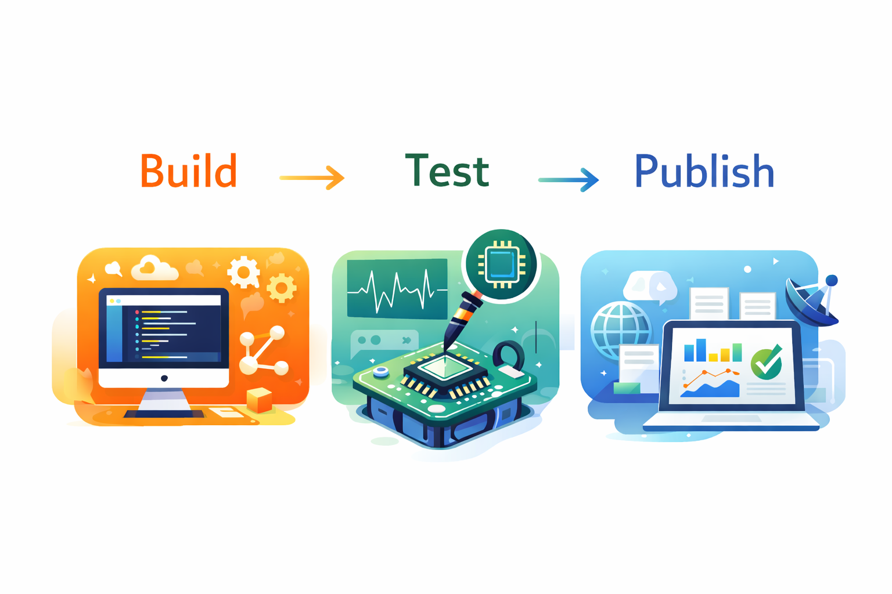
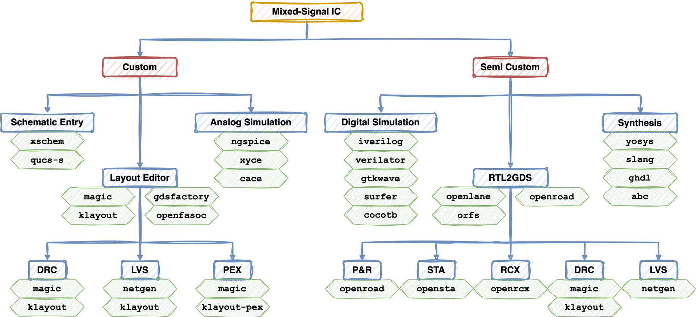

  

**Welcome to the IEEE SSCS Chipathon 2026!**  
This guide provides key information for participants. During the Chipathon, you will choose one of the tracks shown below.

We encourage you to follow the steps below:

1. [General IIC-OSIC Tool setup](./install_instructions)
2. Custom setup
    - [MOSbius playground for chips](https://github.com/mosbiuschip/chipathon2025)
    - [AI/LLM assisted circuits](../resources/Analog_Automation_gLayout/)

For the 2026 Chipathon, we will use the open-source GlobalFoundries 180nm (gf180mcuD) process design kit (PDK). You can refer to the links below for more information:

- [Github Repository](https://github.com/google/gf180mcu-pdk)
- [Documentation](https://gf180mcu-pdk.readthedocs.io/en/latest/)
- YouTube Videos
   - Tutorial using Xschem and ngspice with gf180mcu

     👉 🔹 [part 1](https://youtu.be/MdywD87-DVg)  🔹 [part 2](https://youtu.be/DLvZSsLAbho)  🔹 [part 3](https://youtu.be/nBnR8Nm_B_I)  🔹 [part 4](https://youtu.be/vamfMryYPS4) 
   - [Working with GF180MCU PDK](https://www.youtube.com/playlist?list=PLZuGFJzpFksCU7yKn2P_xRTOktVBDWAJf) (credit: Amro Tork)

  
# 1. General Tool Setup

The following guidelines help you set up the tools using the [IIC-OSIC-TOOLS](https://github.com/iic-jku/iic-osic-tools) Docker image developed by Harald Pretl's team.

:rotating_light: **NOTE**: For this Chipathon, it is not required to use the repository for the IIC-OSIC-TOOLS directly, since startup-scripts are provided in [resources/IIC-OSIC-TOOLS](/resources/IIC-OSIC-TOOLS).

:warning: **NOTE**: For this Chipathon, a special image of the IIC-OSIC-TOOLS is released, with the tag "chipathon". If you use the start-scripts provided here, this tag is used automatically.

Please start with the Quick Start Guide and setup Docker Desktop and the IIC-OSIC-TOOLS. Then, choose one of the following tutorial links to set up the tools, which best fits your environment. Experienced users may configure the tools using their own preferred approach.

The **MOSbius playground** and **AI/LLM assisted circuits** tracks require slight variations of the general tool setup. Once you are familiar with the general procedure, adapting it for each track should be straightforward.

👉 [Chipathon 2026 IIC-OSIC Docker Setup](./install_instructions)

<!-- - **[Windows/MacOS only]**  
👉 Kwantae Kim's [Blog Post](https://kwantaekim.github.io/2024/05/25/OSE-Docker/)  
🌱 Beginner-friendly
- **[Any OS]**  
👉 [gLayout extra steps](../resources/Analog_Automation_gLayout/files/gLayout_Install.md)
👉 Saptarshi Ghosh's [Google Doc](https://docs.google.com/document/d/13r-pB7vhYnCb-n46CAAlqXrKSj99bQtmEeyoayEV3Ak/edit?tab=t.0)  
👉 Boris Murmann's [Github](https://github.com/bmurmann/EE628/tree/main/3_Tools) -->

The image below provides a quick overview of the open-source toolchain (credit: Harald Pretl).

  

  

# 2. Track-Specific Setup

## MOSbius playground

- [`resources/MOSbius`](https://github.com/mosbiuschip/chipathon2025)  
👉 Gateway redirecting to `mosbiuschip` repository (below), developed by Peter Kinget and Juan Sebastian Moya's team.
- [mosbiuschip](https://mosbius.org/0_front_matter/intro.html)  
👉 Github repository for general info and resources of `mosbius` track. The `mosbius`-specific setup guide can be also found.

## AI/LLM assisted circuits

- [`resources/AnalogAutomation_gLayout`](../resources/Analog_Automation_gLayout/README.md)  
👉 General information and resources of `Glayout` developed by Mehdi Saligane's team, a Python-powered analog layout automation tool.
- [gLayout extra setup steps](../resources/Analog_Automation_gLayout/files/gLayout_Install.md)  
👉 `Glayout`-specific setup guide
- [gLayout repo](https://github.com/ReaLLMASIC/gLayout)  
👉 Github repository for general info and resources of `gLayout` tool.
