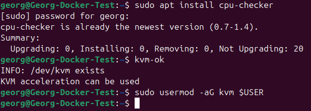
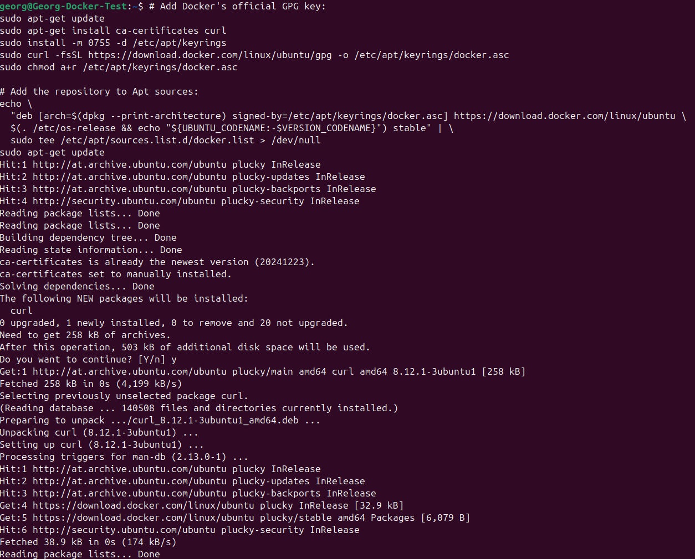
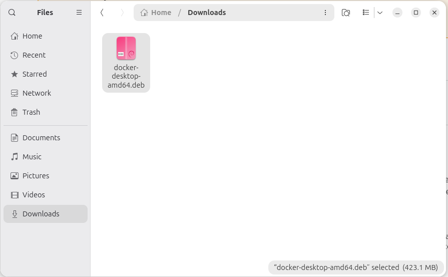
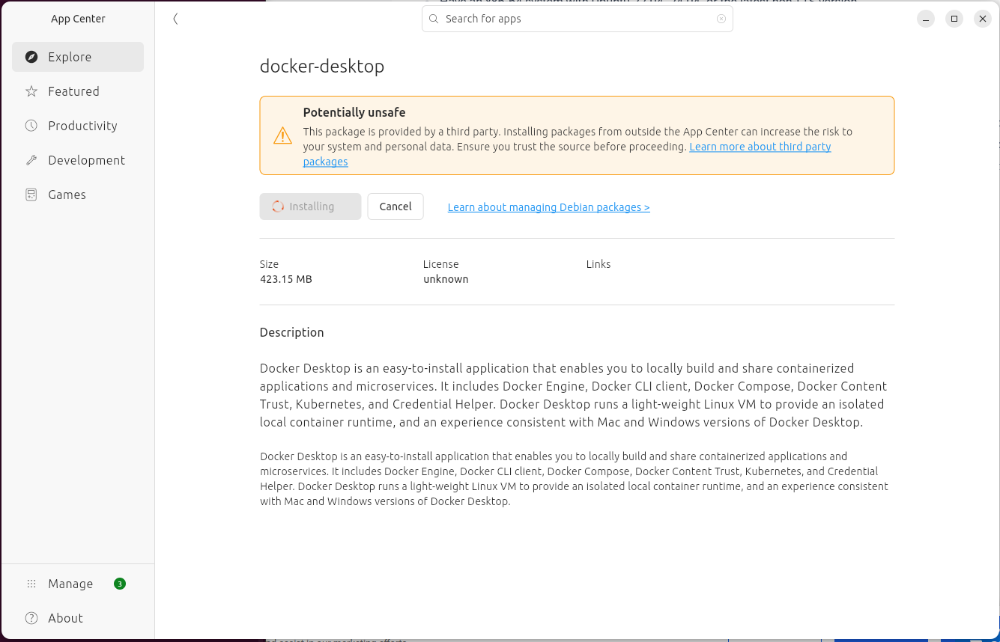
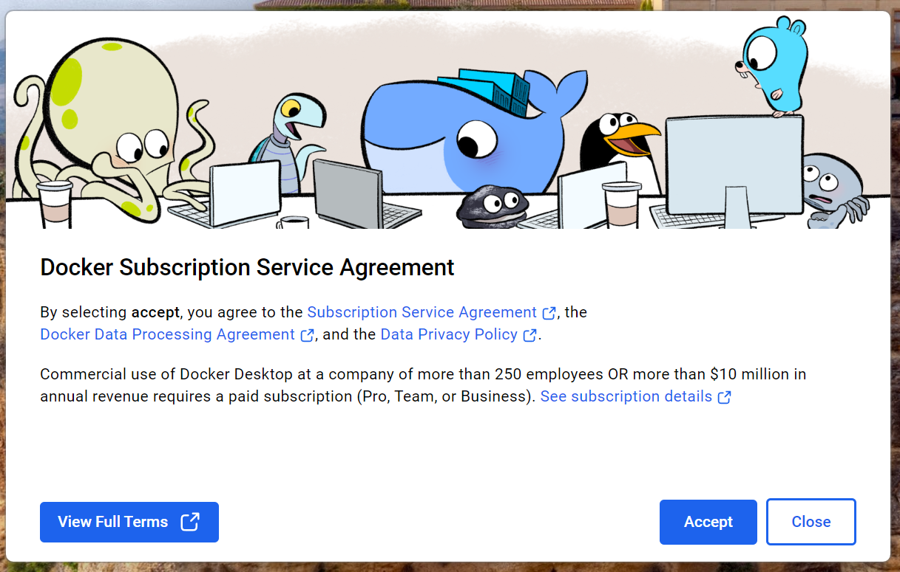
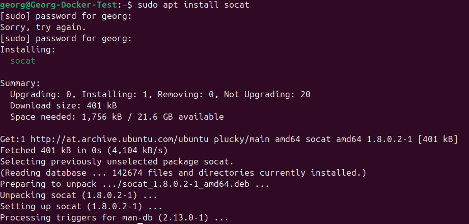
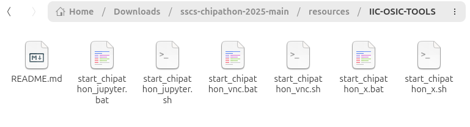
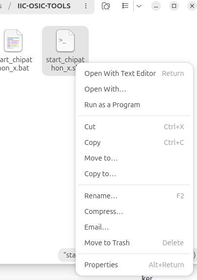
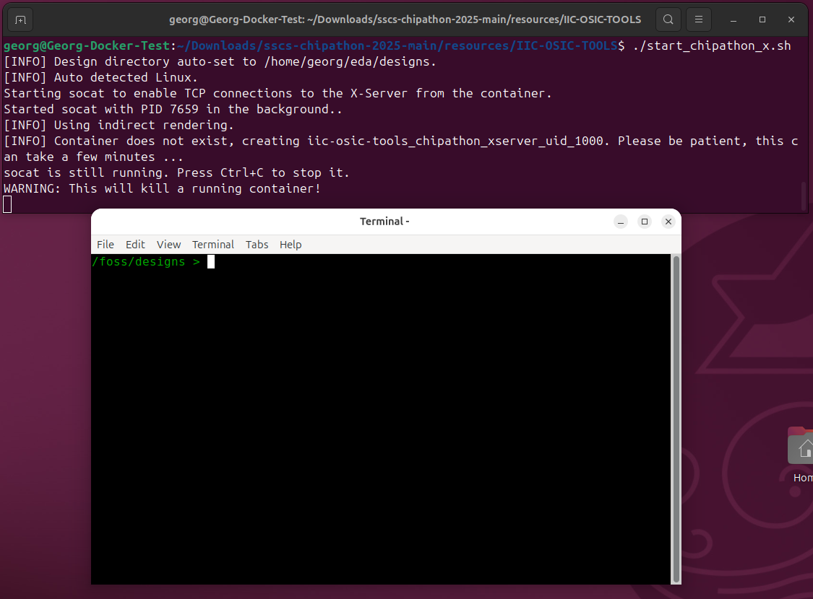
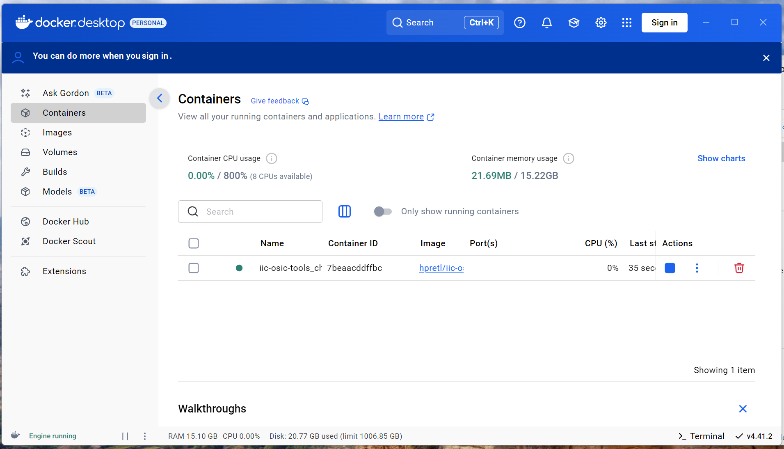

# How To Install IIC-OSIC-TOOLS on Linux

This quick start guide explains how to get the IIC-OSIC-TOOLS up and running with Docker Desktop on Linux.

## Initial Notes

This installation shows how the installation works with Docker Desktop on Ubuntu 25.04. Docker Desktop is the easy way to manage Docker Containers, since it also provides a GUI. If you are familiar with Docker (or you are good with the terminal ;) ), we recommend you to use the classic Docker CE without a GUI, since it has better performance. But, to say it again: the safe route is Docker Desktop!

## Docker Desktop Install

A detailed explanation can be found on [Install Docker Desktop on Linux](https://docs.docker.com/desktop/setup/install/linux/). Follow this installation tutorial, especially when you are not on Ubuntu!


1. Check if your system has KVM (the Kernel Virtual Machine, required to run Docker Desktop) enabled. Do this by running
`sudo apt install cpu-checker` and then running `kvm-ok`. If it outputs that "KVM acceleration can be used" you are fine.  
Additionally, you have to add your user to the KVM group so you can run virtual machines: `sudo usermod -aG kvm $USER`.


2. Enable the Docker Repository in Ubuntu, run the following script in the terminal:
```
# Add Docker's official GPG key:
sudo apt-get update
sudo apt-get install ca-certificates curl
sudo install -m 0755 -d /etc/apt/keyrings
sudo curl -fsSL https://download.docker.com/linux/ubuntu/gpg -o /etc/apt/keyrings/docker.asc
sudo chmod a+r /etc/apt/keyrings/docker.asc

# Add the repository to Apt sources:
echo \
  "deb [arch=$(dpkg --print-architecture) signed-by=/etc/apt/keyrings/docker.asc] https://download.docker.com/linux/ubuntu \
  $(. /etc/os-release && echo "${UBUNTU_CODENAME:-$VERSION_CODENAME}") stable" | \
  sudo tee /etc/apt/sources.list.d/docker.list > /dev/null
sudo apt-get update
```
This should look something like this:


3. Download Docker Desktop [here](https://desktop.docker.com/linux/main/amd64/docker-desktop-amd64.deb?utm_source=docker&utm_medium=webreferral&utm_campaign=docs-driven-download-linux-amd64) (Ubuntu, x86_64; for different architectures, check the website)

4. Double-click the .deb file and install it using Software Center. Since the Repository is already enabled, all required dependencies are pulled in automatically.




5. Launch "Docker Desktop" from your Start menu or the desktop shortcut. Docker will ask you about the Subscription Serice Agreement.


6. Docker starts up now. You can skip the login and the initial questionare. It takes a few moments for Docker to start the engine.

7. Docker is now started up and ready to use!


8. If you are planing on using the X/Wayland mode, you have to install "socat", which provides the interface between the container and the hosts graphical environment. Do this by running `sudo apt install -y socat`.


8. Navigate to the SSCS-Chipathon files. In resources/IIC-OSIC-TOOLS you find the start scripts that automate the container setup. Select the mode (X/Wayland, VNC or Jupyter only) based on your needs and right-click on the corresponding shell-script (which has the ending .sh if shown) and hit "Run as Program".



9. If everything works as expected, a Terminal will open up and Docker will now pull (more or less download) the container image. This process can take a while, depending on your Internet speed and computer. WARNING: This process might use more than 20 GB of storage on your machine. Please make sure that enough space is free on your harddrive.

10. After all layers of the image have been downloaded and unpacked, you should see the following output in the terminal. It should be noted, that the terminal will close after the script has exited.


11. Now the container should be running. If you selected the X11/Wayland mode, a terminal like in the previous picture should be visible.
For all the other modes, everything will run in the background. For the VNC-Mode, open a browser and navigate to [http://localhost:80](http://localhost:80), the default password is "abc123". For the Jupyter-Mode, open [http://localhost:8888](http://localhost:8888).

## Tips and Tricks

### Store Files Persistently
Our container is designed in a way, so you can share files between the host and the container. On the host, you find this directory in your user-directory in eda\designs (Usually this is /home/<username>/eda/designs). In the container, it is found in /foss/designs.  
IMPORTANT: This is the only directory that is persistent through a container update! Any other files in the container are deleted when the container is deleted or updated!

### Does my container even run?
If your container does not open a terminal, or nothing can be opened after starting it, there might be a chance something went wrong or it is not running. To verify this, open the Docker Desktop Application and click on "Containers". Now you can see if your container exists and if it is running.  

Also, this page can be used to stop, restart and delete the container. Usually, deleting is not required, unless you need to update the container!

### How to Update the Container
During the whole Chipathon, there will be some updates to the container. The update procedure is as follows:
1. Go to the Docker Desktop app and stop and delete the container.
2. Go to "Images". To pull a new version click the three dots and "Pull". You can do this here:

3. Run the start-script again.