# How To Install IIC-OSIC-TOOLS on Windows

This quick start guide explains how to get the IIC-OSIC-TOOLS up and running with Docker Desktop on Windows!

## Initial Notes

This installation assumes a resonably modern and updated installation of Windows 10 or 11. This means that WSL2 supports the WSLg graphical backend, which provides the required X-Server and Wayland interfaces to the container.  

## Docker Desktop Install

A detailed explanation can be found on [Install Docker Desktop on Windows](https://docs.docker.com/desktop/setup/install/windows-install/).

1. Download Docker Desktop [here](https://desktop.docker.com/win/main/amd64/Docker%20Desktop%20Installer.exe?utm_source=docker&utm_medium=webreferral&utm_campaign=docs-driven-download-win-amd64) (Windows, x86_64; for different architectures, check the website)

2. Run the installer and enable "Use WSL2 instead of Hyper-V". Do not enable "Allow Windows Containers".
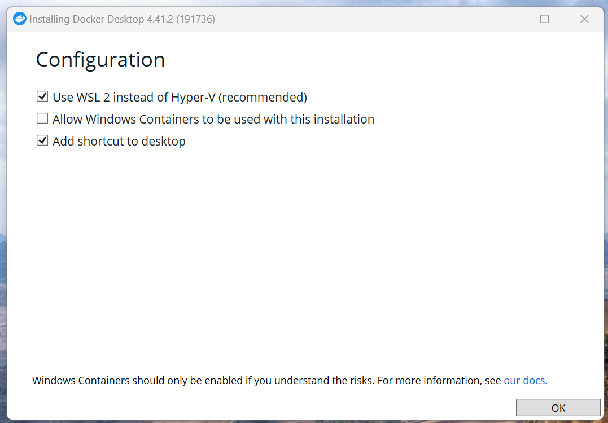

3. After the installation succeeded, press "Close and restart"

4. After the reboot, launch "Docker Desktop" from your Start menu or the desktop shortcut. Docker will ask you about the Subscription Serice Agreement.

5. Docker will now ask you to finish the setup. Select "Use recommended settings". This will require to enter your administrator password at some point!
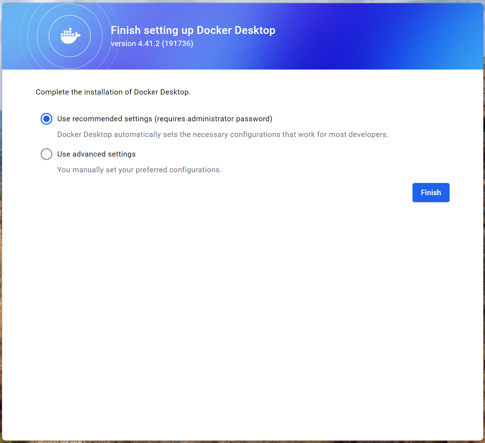

6. Docker starts up now. You can skip the login and the initial questionare. It takes a few moments for Docker to start the engine.
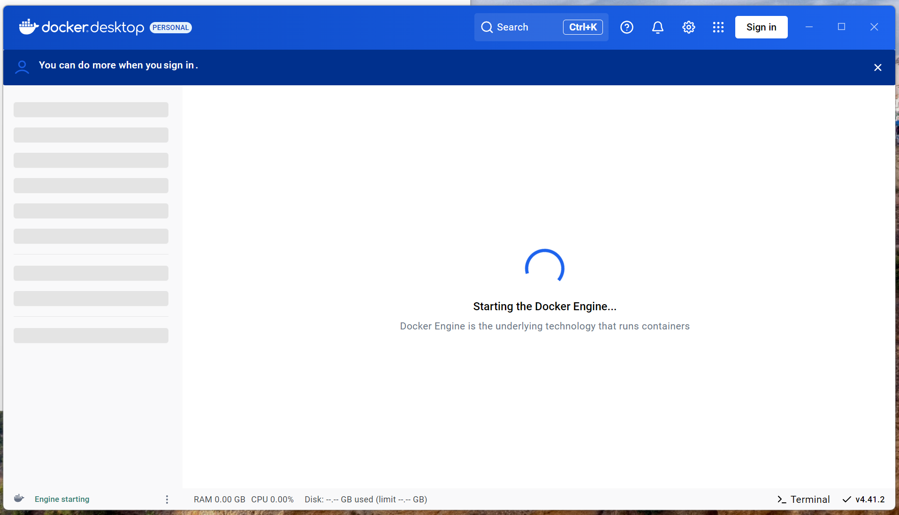

7. Docker is now started up and ready to use!
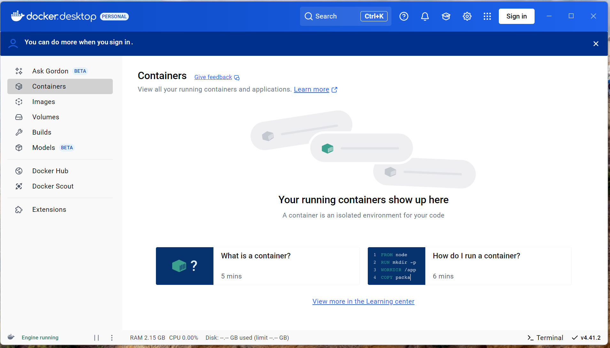

8. Navigate to the SSCS-Chipathon files. In resources/IIC-OSIC-TOOLS you find the start scripts that automate the container setup. Select the mode (X/Wayland, VNC or Jupyter only) based on your needs and double-click on the corresponding batch-script (which has the ending .bat if shown, or is identified by the type "Windows-Batch script".
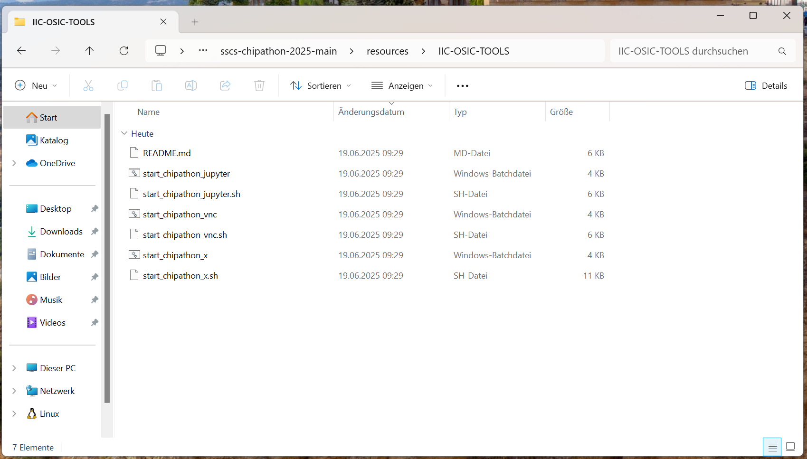
It might happen that Windows Defender blocks the execution of the Batch scripts. Click on "More Information" ("Mehr Informationen") and then "Run anyway" (Trotzdem ausführen").
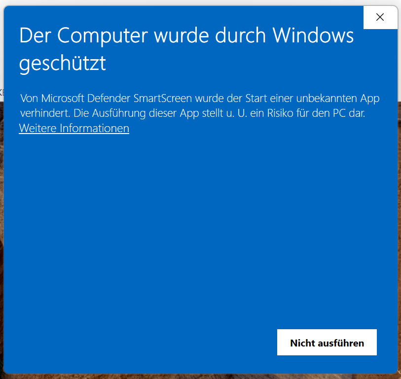
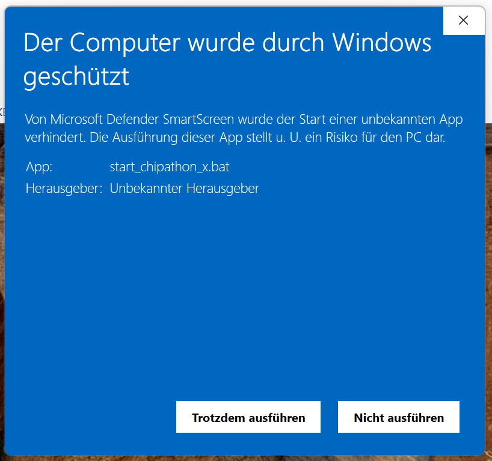

9. If everything works as expected, a cmd prompt will open up and Docker will now pull (more or less download) the container image. This process can take a while, depending on your Internet speed and computer. WARNING: This process might use more than 20 GB of storage on your machine. Please make sure that enough space is free on your harddrive.
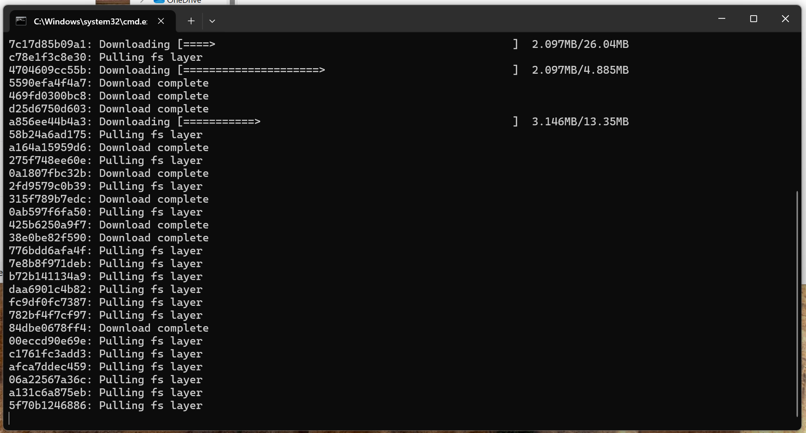

10. After all layers of the image have been downloaded and unpacked, you should see the following output in the cmd prompt. It should be noted, that the cmd prompt will close after the script has exited.
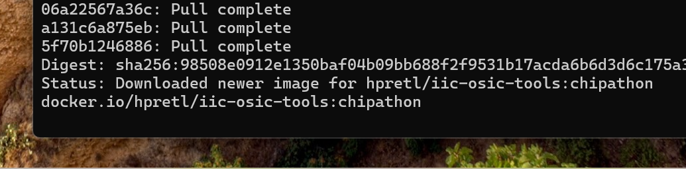

11. Now the container should be running. If you selected the X11/Wayland mode, a terminal like in the following picture should be visible.
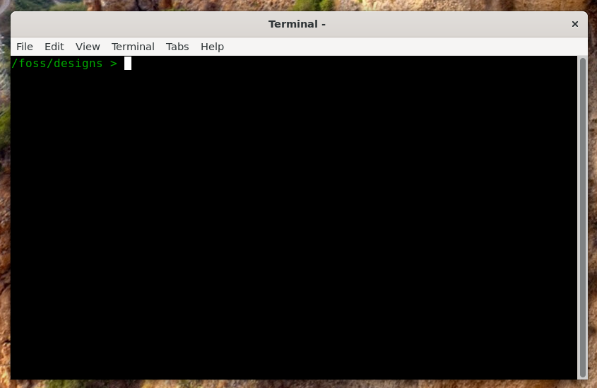
For all the other modes, everything will run in the background. For the VNC-Mode, open a browser and navigate to [http://localhost:80](http://localhost:80), the default password is "abc123". For the Jupyter-Mode, open [http://localhost:8888](http://localhost:8888).

NOTE: It can be, that after pulling the Image, the memory usage of the Docker Engine can be quite high. In the bottom-left of the Docker Desktop app, click on the three dots and "Restart Docker". After this, the memory should be freed again.

## Tips and Tricks

### Store Files Persistently
Our container is designed in a way, so you can share files between the host and the container. On the host, you find this directory in your user-directory in eda\designs (Usually this is C:\Users\<username>\eda\designs). In the container, it is found in /foss/designs.  
IMPORTANT: This is the only directory that is persistent through a container update! Any other files in the container are deleted when the container is deleted or updated!

### Does my container even run?
If your container does not open a terminal, or nothing can be opened after starting it, there might be a chance something went wrong or it is not running. To verify this, open the Docker Desktop Application and click on "Containers". Now you can see if your container exists and if it is running.  

Also, this page can be used to stop, restart and delete the container. Usually, deleting is not required, unless you need to update the container!

### How to Update the Container
During the whole Chipathon, there will be some updates to the container. The update procedure is as follows:
1. Go to the Docker Desktop app and stop and delete the container.
2. Go to "Images". To pull a new version click the three dots and "Pull". You can do this here:
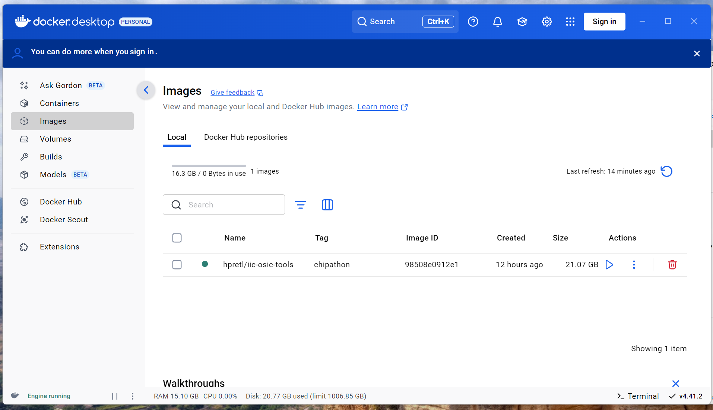
3. Run the start-script again.