# GLayout DEV Environment Setup 

> 🚧 **Under Construction** 

Instructions for Glayout specific steps. For Glayout, we are going to build the Container with additional steps (with the same scripts) to forward Port: 8888 (alongside VNC or X11) to start a Jupyter Server to execute Glayout Notebooks.  

\* Note: gLayout repo can be cloned or downloaded from [here](https://github.com/ReaLLMASIC/gLayout/tree/main). You will need it for Tutorials.

\*\* Note: Keep an eye on the different containers that are being built for different purposes. They have different names and container IDs.

TL;DR Once Docker is up and running, go to the *Container* tab in Docker Desktop, click on the container name and navigate to the *Exec* tab, and in the terminal of Docker, execute 
```bash
bash /dockerstartup/scripts/run_GL.sh
``` 

### More Detailed Steps

#### Step 1 

Build the Docker container with the`start_chipathon_[vnc/x].[.sh/.bat]` scripts as described before.

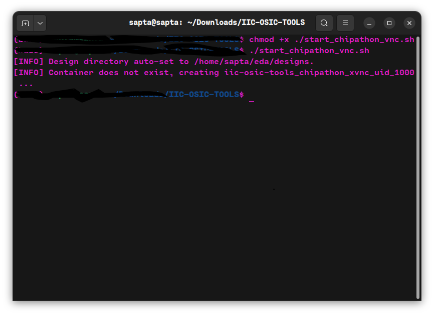

#### Step 2 

Open Docker Desktop Dashboard. Go to the *Containers* tab, and you should see the container running.

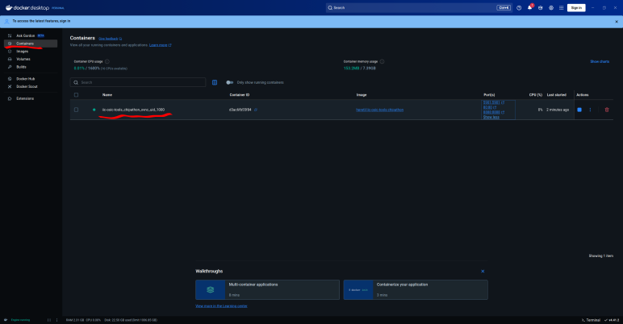

### Step 3 

Navigate to the `Exec` tab (terminal of Docker)

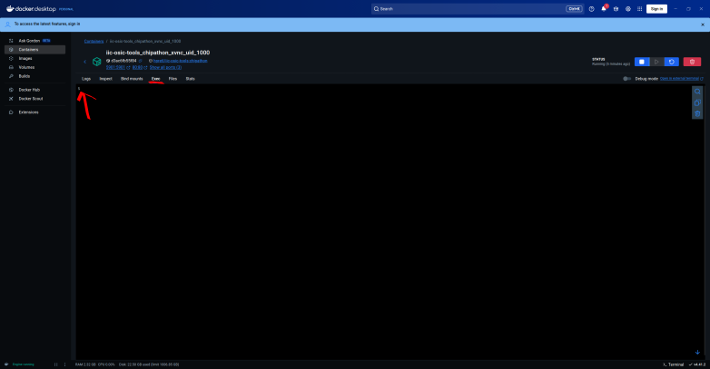

#### Step 4

Type in the terminal window (with `$`)

- run `bash /dockerstartup/scripts/run_GL.sh`

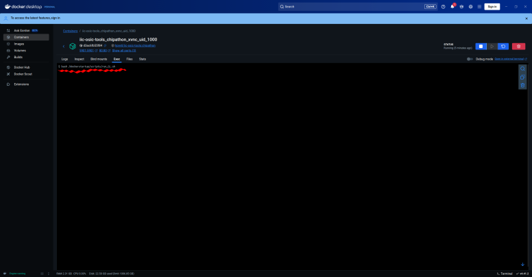


(You can run this command using the VNC or X11 accessed terminal as well.)

This will set up and install the necessary components (will take some time) for the *gLayout* and will start a Jupyter server to access it. You can access it from your browser [http://localhost:8888/lab]() or VS-Code.

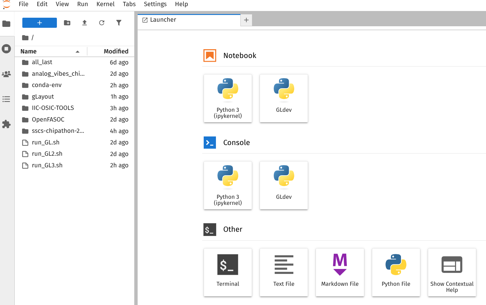

Please note that you would need to restart the Jupyter server if you close or rebuild the Docker container. 

You can run it again by executing the following command in the *Exec* terminal, again. 
```bash
bash /dockerstartup/scripts/run_GL.sh
``` 
 
In case you don't see the *GLdev* kernel in your Jupyter Server 

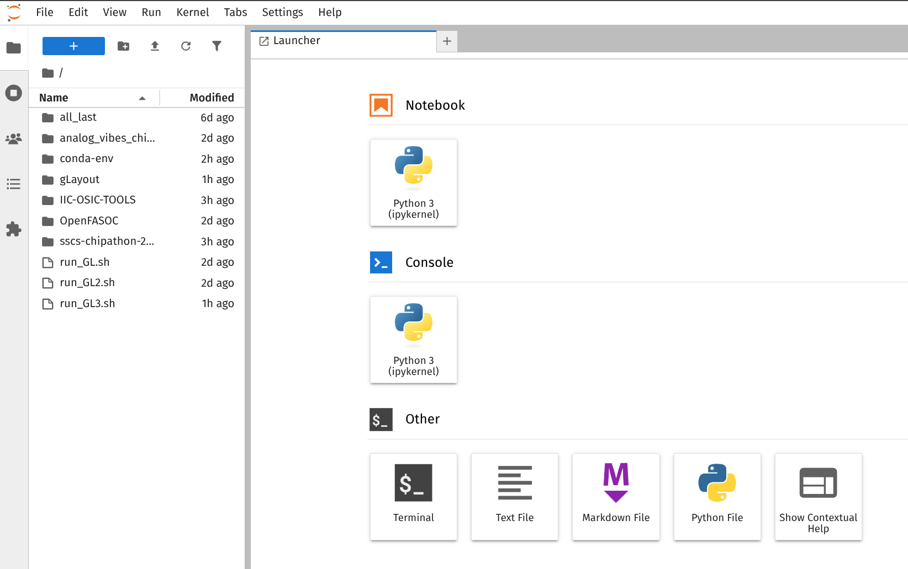

In the *Exec* terminal, 

* First run 
```bash
python -m ipykernel install --user --name="GLdev"
```  
* Then run 
```bash
bash /dockerstartup/scripts/run_GL.sh
```

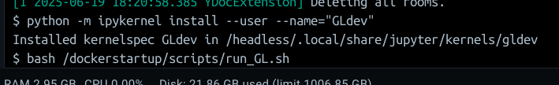

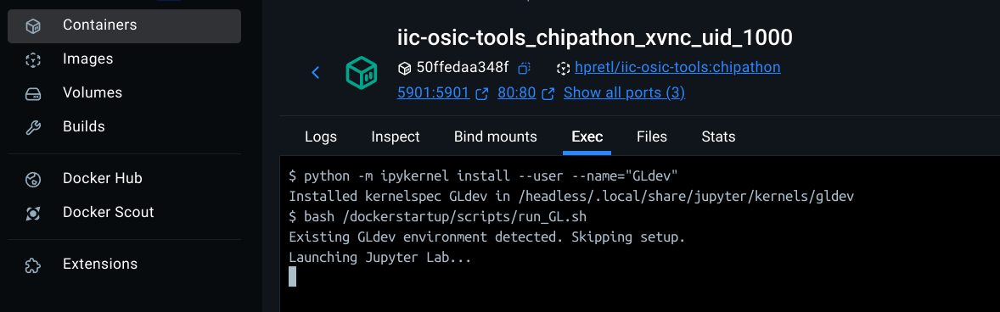

Then you should see the GLdev Kernel. Don’t forget to choose it for all gLayout code.


### Installing KLive and PDK Colour Schemes

To visualise the GDS files generated by the Glayout, you can use the `_.show()` function of the *gdsfactory*. For this to work, you need to have *Klive* plugin installed and running in the *Klayout*. 

1. Run your container using the previously described run scripts   
2. Run KLayout by just typing `klayout` in the terminal of the Docker container   
3. Install KLive  
   1. Go to Tools \-\> Manage Packages \-\> Install New Packages \-\> Search  
   2. Search for KLive  
   3. Install the package that looks like this:  
      
      

      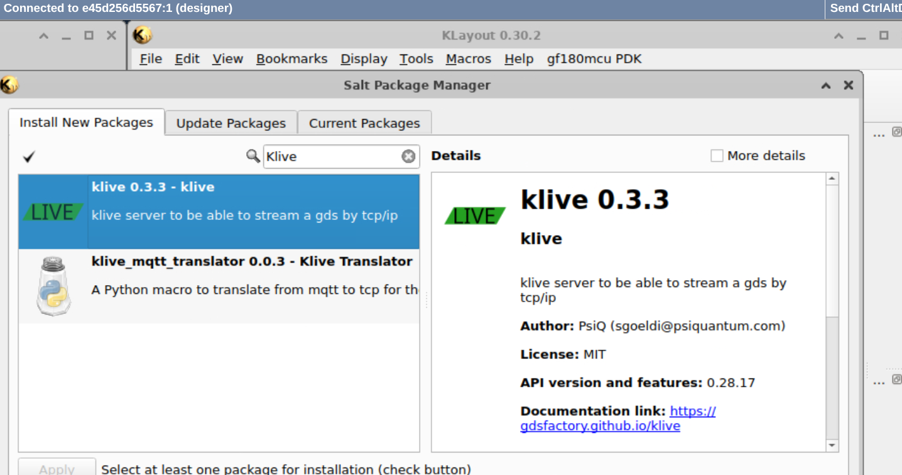

      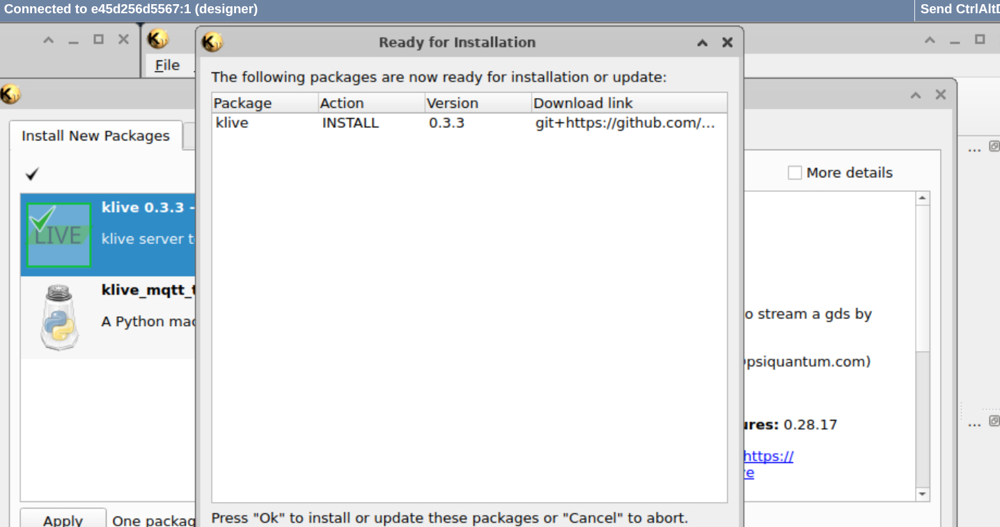

      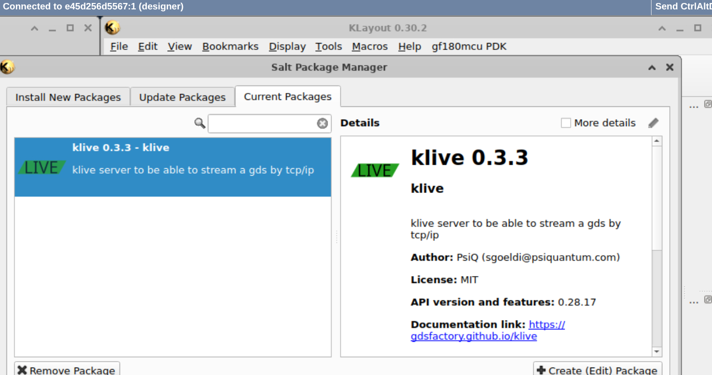

4. Install PDK Color Schemes (You can just source the PDK too with Klayout Path)  
   - Go to Tools \-\> Manage Packages \-\> Install New Packages \-\> Search  
   - Search for *sky130*  
   - Install the package 

Restart *Klauout* for the changes to take effect. You should see green *Klive* tag and you can change pdk from the `T` symbol.

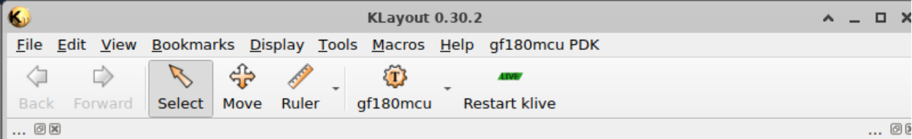


Once it's installed on your host system. Copy the container ID of the most recently started one or the one you installed *Klive*

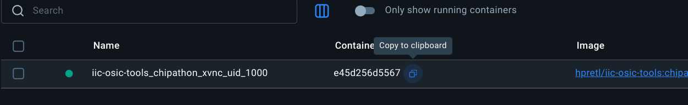

Then in your Host's terminal (not Docker terminal), excecute

```bash
docker commit -a "Jane Doe" -m "Installed Klive" <Container ID> hpretl/iic-osic-tools:chipathon
```

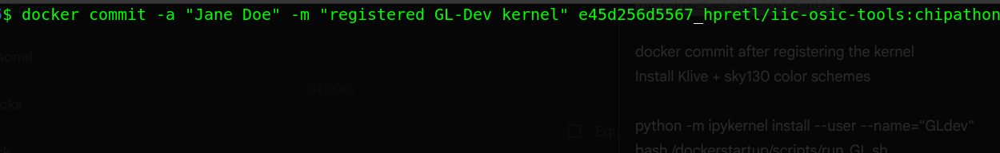

\*\*Note: without committing to the image, Docker image won't retain the changes. 

### Installing the classical Docker CE 

```bash
sudo apt-get install docker-ce docker-ce-cli containerd.io docker-buildx-plugin docker-compose-plugin
```

More Instructions [here](https://docs.docker.com/engine/install/).

### Miscellaneous Docker Commands 

You can see all active dockers with `docker ps -a`.Replace `glayoutcontainer` with your container name or ID. 

1. To remove the container, run the command:   
   1. (Mac) `docker container rm glayoutcontainer`  
   2. (Linux/WSL) `docker rm glayoutcontainer`  
2. To stop a container, run the command:  
   1. (Mac) `docker container stop glayoutcontainer`  
   2. (Linux/WSL) `docker stop glayoutcontainer`  
3. To restart the container, run the command:   
   1. (Mac) `docker container restart glayoutcontainer`  
   2. (Linux/WSL) `docker restart glayoutcontainer`  
4. To execute a running container, first check its status by running   
   1. (Mac) `docker container ls -a` (Linux/WSL) `docker ls -a`  
   2. Then `docker exec -it glayoutcontainer /bin/bash` (if *glayoutcontainer* is running) (`-it` flag runs the container in interactive mode)   
5. To make a permanent change to Docker:   
   1. (Mac) `docker container commit -a "author" -m "message" <container ID> image_name`  
   2. (Linux/WSL) `docker commit -a "author" -m "message" <container ID>`  
      

\* Note: `exit` in a running Docker container halts all running processes and stops. 

A graceful shutdown can be achieved by using `docker stop <container ID>`  